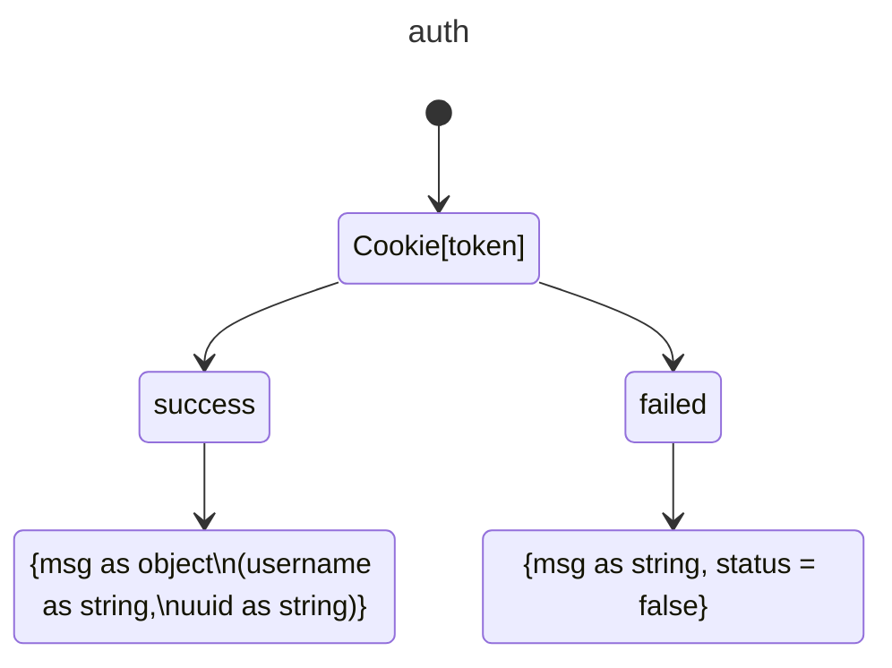

#PENDAHULUAN
```
 Dalam era digital yang terus berkembang, pengembangan aplikasi berbasis web dan real-time menjadi semakin penting. Salah satu teknologi yang banyak digunakan untuk membangun aplikasi backend yang efisien dan skalabel adalah NestJS. NestJS adalah framework berbasis Node.js yang menggunakan TypeScript dan mengadopsi arsitektur modular, sehingga memudahkan pengembang dalam membangun, mengelola, dan memperluas aplikasi.

    Lab latihan ini bertujuan untuk memberikan pemahaman mendalam mengenai struktur proyek NestJS serta implementasi berbagai fitur penting, seperti autentikasi, pengelolaan database dengan Prisma, serta komunikasi real-time menggunakan WebSocket. Dengan mengikuti latihan ini, diharapkan peserta dapat memahami konsep dasar pengembangan backend modern serta mampu menerapkan best practices dalam pengembangan aplikasi menggunakan NestJS.

    Struktur proyek latihan ini mencakup berbagai modul, termasuk modul **Chat**, **Profile**, serta penggunaan **Prisma** sebagai ORM untuk pengelolaan database. Setiap bagian dalam proyek ini dirancang untuk membantu peserta memahami bagaimana membangun layanan backend yang modular, aman, dan dapat diandalkan.

    Melalui lab ini, peserta akan:
    1. Memahami struktur proyek dalam NestJS.
    2. Mengimplementasikan autentikasi pengguna.
    3. Menggunakan Prisma untuk mengelola database.
    4. Mengembangkan layanan berbasis WebSocket untuk komunikasi real-time.
    5. Menerapkan konsep DTO (Data Transfer Object) dan entity dalam pengelolaan data.

    Dengan mengikuti latihan ini, peserta diharapkan memiliki keterampilan dasar dalam pengembangan backend menggunakan NestJS dan mampu mengaplikasikan teknologi ini dalam proyek nyata.
```
# Project Structure
````
    📦dist
    📦prisma
     ┗ 📜schema.prisma
    📦src
     ┣ 📂chat
     ┃ ┣ 📂dto
     ┃ ┃ ┣ 📜create-chat.dto.ts
     ┃ ┃ ┗ 📜update-chat.dto.ts
     ┃ ┣ 📂entities
     ┃ ┃ ┗ 📜chat.entity.ts
     ┃ ┣ 📜chat.gateway.spec.ts
     ┃ ┣ 📜chat.gateway.ts
     ┃ ┣ 📜chat.module.ts
     ┃ ┣ 📜chat.service.spec.ts
     ┃ ┗ 📜chat.service.ts
     ┣ 📂dto
     ┃ ┣ 📜catatan.txt
     ┃ ┣ 📜create-mahasiswa.dto.ts
     ┃ ┣ 📜login-user.dto.ts
     ┃ ┣ 📜register-user.dto.ts
     ┃ ┗ 📜update-mahasiswa.dto.ts
     ┣ 📂entity
     ┃ ┗ 📜user.entity.ts
     ┣ 📂profile
     ┃ ┣ 📜profile.controller.spec.ts
     ┃ ┣ 📜profile.controller.ts
     ┃ ┣ 📜profile.module.ts
     ┃ ┣ 📜profile.service.spec.ts
     ┃ ┗ 📜profile.service.ts
     ┣ 📜app.controller.spec.ts
     ┣ 📜app.controller.ts
     ┣ 📜app.module.ts
     ┣ 📜app.service.ts
     ┣ 📜auth-module.ts
     ┣ 📜auth.guard.ts
     ┣ 📜main.ts
     ┣ 📜prisma.servis.ts
     ┣ 📜prisma.ts
     ┗ 📜user.decorator.ts
     📦test
     ┣ 📜app.e2e-spec.ts
     ┗ 📜jest-e2e.json
     📦uploads
     ┗ 📜105841106922-1738231723215-614657552.jpg
     ┣ 📜.env
     ┣ 📜.gitignore
     ┣ 📜.prettierrc
     ┣ 📜 nest-cli.json
     ┣ 📜 package-lock.json
     ┣ 📜 package.json
     ┣ 📜 README.md
     ┣ 📜 tsconfig.build.json
     ┗ 📜 tsconfig.json
````
 


Feel free to add more details about each file and directory as needed.

## Teknologi yang Digunakan di Projek Ini

Projek ini menggunakan beberapa teknologi dan pustaka berikut:
```
    - Node.js: JavaScript runtime yang dibangun di atas mesin V8 Chrome.
    - *NestJS: Framework untuk membangun aplikasi server-side yang efisien dan skalabel.
    - TypeScript: Superset dari JavaScript yang menambahkan tipe statis.
    - Prisma: ORM (Object-Relational Mapping) untuk TypeScript dan Node.js.
    - Jest: Framework pengujian JavaScript yang fokus pada kesederhanaan.
    - Prettier: Code formatter yang mendukung berbagai bahasa pemrograman.
    - ESLint: Linter untuk JavaScript dan TypeScript yang membantu menjaga kualitas kode.
    - Docker: Platform untuk mengembangkan, mengirim, dan menjalankan aplikasi dalam container.

    Pastikan untuk menginstal semua dependensi yang diperlukan dengan menjalankan perintah `npm install` sebelum memulai pengembangan.
```
    

## Instalasi Proyek Nest.js

Untuk memulai proyek Nest.js, ikuti langkah-langkah berikut:

1. **Clone repositori**:
    bash
   ```
    git clone https://github.com/basohamzah24/LAB-BACKEND
   ```

    Masuk ke Direktori Proyek
   ` cd latihan-nest`
    

3. **Instal dependensi**:
    bash
    npm install
    

4. **Rubah nilai dari DATABASE_URL di file .env**
    ```
    DATABASE_URL = [url dari database]
    ```

5. **Jalankan perintah ini untuk langsung menyinkronkan skema Prisma ke database**:
    bash
   ```
   npx prisma generate
   ```


7. **Jalankan aplikasi**:
    bash
   ```
    npm run start:dev
   ```
   ```
   Aplikasi sekarang berjalan di `http://localhost:3000`.
   ```

# Diagram Proyek

````mermaid
---
title: Login User
---
stateDiagram-v2
    [*] --> InputLogin : Masukkan username & password
    InputLogin --> RequestLogin : Kirim POST /login
    RequestLogin --> SuccessLogin : Kredensial valid
    RequestLogin --> FailedLogin : Kredensial tidak valid
    SuccessLogin --> ResponseSuccessLogin : Token dan data user diterima (201)
    FailedLogin --> ResponseFailedLogin : Login gagal, kredensial salah (401)
    ResponseSuccessLogin --> [*]
    ResponseFailedLogin --> [*]
````

````mermaid
---
title: Register
---
stateDiagram-v2
    [*] --> InputRegister : Masukkan username, email & password
    InputRegister --> RequestRegister : Kirim POST /register
    RequestRegister --> SuccessRegister : Registrasi berhasil
    RequestRegister --> FailedRegister : Registrasi gagal
    SuccessRegister --> ResponseSuccessRegister : Token dan data user diterima (201)
    FailedRegister --> ResponseFailedRegister : Registrasi gagal, data tidak valid (400)
    ResponseSuccessRegister --> [*]
    ResponseFailedRegister --> [*]
````
````mermaid
---
title: SearchMahasiswa
---
stateDiagram-v2
    [*] --> InputSearchMahasiswa : Masukkan NIM (Opsional)
    InputSearchMahasiswa --> RequestSearchMahasiswa : Kirim GET /mahasiswa
    RequestSearchMahasiswa --> SuccessSearchMahasiswa : Mahasiswa ditemukan (200)
    RequestSearchMahasiswa --> FailedSearchMahasiswa : Mahasiswa tidak ditemukan (401)
    SuccessSearchMahasiswa --> ResponseSuccessSearchMahasiswa : Data mahasiswa
    FailedSearchMahasiswa --> ResponseFailedSearchMahasiswa : Mahasiswa tidak ditemukan
    ResponseSuccessSearchMahasiswa --> [*]
    ResponseFailedSearchMahasiswa --> [*]

````


